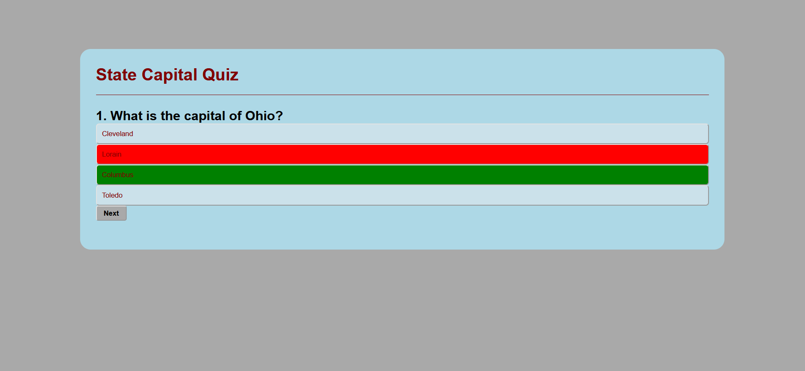

# Module 4 Quiz Challenge

## Description

The module 4 assignment had the bootcamp students put together a simple quiz app. No starter code was given, so we had to design the app to look clean and function properly. The goal of this quiz is to correctly guess four US state capitals. At the end of the quiz, the program will tell you how many you guessed correctly and will give you the ability to restart.

## Installation

N/A

## Usage

Once you enter the web page, you will see a question asking which state capital belongs to Ohio. This is the first question of four. 

When you select an answer, the app will change the color of the correct answer to green. If you selected a wrong answer, the answer you selected will change to the color red. After guessing, you will need to press the next button to show the next question. Here is an example of an incorrect guess: 

## Credits

N/A

## License

N/A